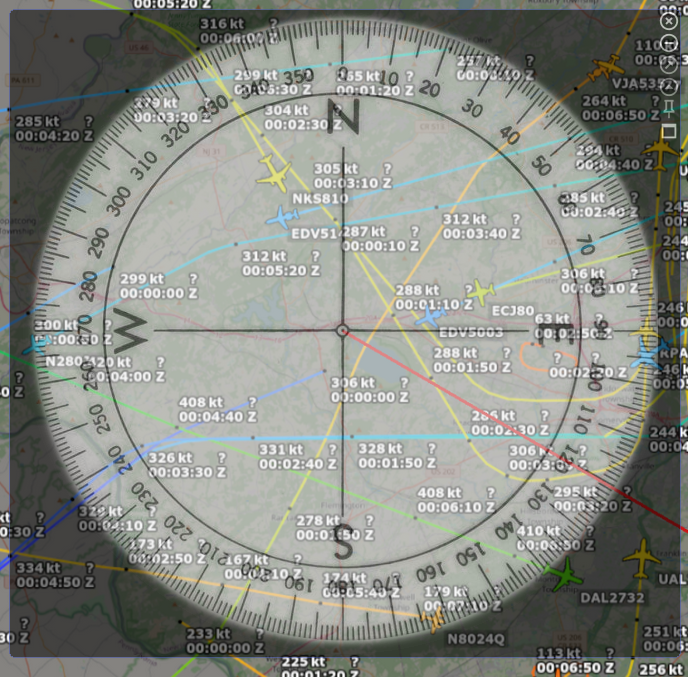

Simple screen protractor / compass using [raylib](https://github.com/raysan5/raylib) meant for viewing above map images oriented North to determine headings from lines of sight.



| Key         | Action                               |
| ----------- | ------------------------------------ |
| Escape or q | Exit the program                     |
| Minus (-)   | Decrease window opacity              |
| Equal (=)   | Increase window opacity              |
| Zero (0)    | Reset opacity to 0.5                 |
| d           | Toggle window decorations / titlebar |

Note: Mouse dragging via raylib was a little buggy (probably due to my lack of experience with raylib), so it is disabled, use the titlebar to drag the window for now.

This was initially written in C, then ported to the [zig programming language](https://ziglang.org). There was no real need as it's a very simple program, but I wanted to play with zig some more and zig works on the three major platforms, plus it can cross-compile to any of them. The [rust programming language](https://www.rust-lang.org/) has similar benefits and is widely more popular and so more available, so now here is a rust branch.

To build, install rust, clone this repository's rust branch and run cargo build.

```shell
git clone -b rust https://github.com/JCallicoat/protractor
cd protractor
cargo build --release
```

The program will be in `target/release/protractor` on linux and mac, and `target/release/protractor.exe` on windows.

The program can be installed to `$CARGO_HOME/bin` (~/.cargo/bin by default) with `cargo install --path .`.
